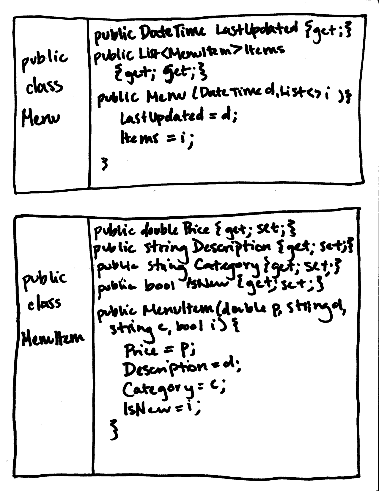

# Studio 3: Restaurant Menu
Solution for Studio 3 in [C# Web Development](https://education.launchcode.org/csharp-web-development/chapters/classes/studio.html)

## Notes
While this studio is very subjective, we hope that providing you with an example of how this may appear at the end of the class period is helpful.

## Diagram

Students are asked to draw what the ``Menu`` and ``MenuItem`` classes should look like before they start coding.
Ultimately, the most important thing is to ask questions about why students chose specific acccess modifiers and talk about object-oriented programming.
These decisions should be guided by best practices, but there is not necessarily a right and wrong answer.

## Example

After students finish their diagrams, they can start coding their classes. The solution code in this repo is based on this example diagram:

